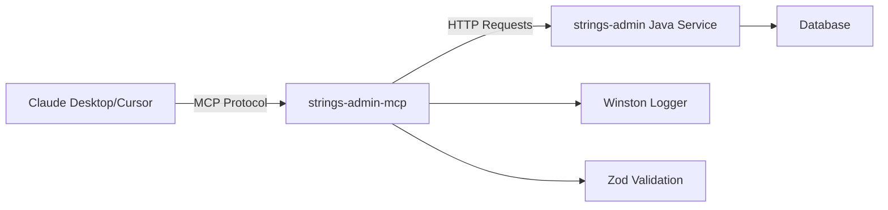

# strings-admin-mcp

Model Context Protocol (MCP) server for Duda strings admin service.

## 📋 Overview

This MCP server provides a standardized interface for managing translation strings through the Duda strings-admin Java service. It exposes two powerful tools that can be used by any MCP-compatible AI client like Claude Desktop or Cursor.

### Available Tools

- **`duda_strings_admin_get_all_scopes`** - Retrieve all available scopes for string organization
- **`duda_strings_admin_create_new_string_key`** - Create new translatable string keys in specified scopes

## 🚀 Quick Start

### Prerequisites

- **Node.js 20+ LTS** (required for FastMCP and modern dependencies)
- Access to Duda strings-admin Java service
- Claude Desktop, Cursor, or another MCP-compatible client

### Installation

```bash
# Clone or navigate to the project directory
cd /path/to/mcp-strings-admin

# Install dependencies
npm install

# Build the TypeScript project
npm run build

# Test the server (optional)
npm test
```

### Basic Usage

```bash
# Start the MCP server (listens on stdin/stdout)
npm start

# Development mode with auto-reload
npm run dev
```

## ⚙️ Configuration

### Environment Variables

Configure the server using these environment variables:

| Variable | Default | Description |
|----------|---------|-------------|
| `STRINGS_ADMIN_HOST` | `http://172.31.45.202` | Java service base URL |
| `BASE_PATH` | `/ms/strings-admin/internal/` | API base path |
| `LOG_LEVEL` | `info` | Logging level (`debug`, `info`, `warn`, `error`) |
| `HTTP_TIMEOUT_MS` | `5000` | HTTP request timeout in milliseconds |

### Example Environment Setup

```bash
# .env file (optional)
STRINGS_ADMIN_HOST=http://your-strings-admin-server:8080
LOG_LEVEL=debug
HTTP_TIMEOUT_MS=10000
```

## 🖥️ Claude Desktop Integration

### Step 1: Locate Claude Desktop Configuration

**macOS:**
```bash
~/Library/Application Support/Claude/claude_desktop_config.json
```

**Windows:**
```bash
%APPDATA%\Claude\claude_desktop_config.json
```

**Linux:**
```bash
~/.config/Claude/claude_desktop_config.json
```

### Step 2: Add MCP Server Configuration

Add the following configuration to your `claude_desktop_config.json`:

```json
{
  "mcpServers": {
    "strings-admin": {
      "command": "node",
      "args": ["/path/to/mcp-strings-admin/dist/index.js"],
      "env": {
        "LOG_LEVEL": "info"
      }
    }
  }
}
```

### Step 3: Restart Claude Desktop

Close and reopen Claude Desktop. The strings-admin tools should now be available.

### Step 4: Verify Integration

In Claude Desktop, try asking:
```
"Can you show me all available string scopes?"
```

Claude should automatically use the `duda_strings_admin_get_all_scopes` tool.

## 🎯 Cursor Integration

### Step 1: Open Cursor Settings

1. Open Cursor
2. Go to **Settings** → **Extensions** → **MCP**
3. Or use `Cmd/Ctrl + ,` and search for "MCP"

### Step 2: Add MCP Server

In the MCP settings, add a new server:

```json
{
  "name": "strings-admin",
  "command": "node",
  "args": ["/path/to/mcp-strings-admin/dist/index.js"],
  "env": {
    "STRINGS_ADMIN_HOST": "http://your-java-service:8080",
    "LOG_LEVEL": "info"
  }
}
```

### Step 3: Enable and Restart

1. Enable the "strings-admin" MCP server
2. Restart Cursor
3. The tools should be available in the AI chat

### Step 4: Verify Integration

In Cursor's AI chat, try:
```
"List all string scopes using the strings admin tool"
```

## 📖 Usage Examples

### Example 1: List All Scopes

**Prompt:** "Show me all available scopes for translation strings"

**Expected Tool Call:**
```json
{
  "tool": "duda_strings_admin_get_all_scopes",
  "parameters": {}
}
```

**Response:** JSON array of scopes with `value` and `shouldTranslate` properties.

### Example 2: Create a New String

**Prompt:** "Create a new string key 'order.status.shipped' with value 'Order has been shipped' in the 'checkout' scope, and it should be translatable"

**Expected Tool Call:**
```json
{
  "tool": "duda_strings_admin_create_new_string_key",
  "parameters": {
    "key": "order.status.shipped",
    "value": "Order has been shipped", 
    "shouldTranslate": true,
    "scopeValue": "checkout"
  }
}
```

**Response:** Success confirmation message.

### Example 3: Batch Operations

**Prompt:** "First show me all scopes, then create a new string 'welcome.message' with value 'Welcome to our store' in the most appropriate scope"

The AI will:
1. Call `get_all_scopes` to see available options
2. Analyze the scopes and choose an appropriate one
3. Call `create_new_string_key` with the new string

## 🛠️ Development

### Project Structure

```
src/
├── config/           # Environment configuration
├── types/            # TypeScript interfaces  
├── utils/            # Utilities (logger, HTTP client)
├── tools/            # MCP tool implementations
├── __tests__/        # Comprehensive test suite
└── index.ts          # Main server entry point
```

### Running Tests

```bash
# Run all tests
npm test

# Run tests in watch mode  
npm run test:watch

# Run with coverage
npm run test:coverage
```

### Development Commands

```bash
# Development mode with auto-reload
npm run dev

# Build TypeScript
npm run build

# Type checking only
npx tsc --noEmit

# Linting
npm run lint

# Format code
npm run format
```

### Adding New Tools

1. Create tool definition in `src/tools/`
2. Add comprehensive tests in `src/__tests__/`
3. Register tool in `src/index.ts`
4. Update this README

## 🔧 Troubleshooting

### Common Issues

#### 1. "Command not found" in Claude Desktop

**Problem:** Claude Desktop can't find the `node` command.

**Solution:** Use absolute path to Node.js:
```json
{
  "command": "/usr/local/bin/node",
  "args": ["/path/to/mcp-strings-admin/dist/index.js"]
}
```

Find your Node.js path with: `which node`

#### 2. "Module not found" errors

**Problem:** Dependencies not installed or built.

**Solution:**
```bash
cd /path/to/mcp-strings-admin
npm install
npm run build
```

#### 3. Connection timeout to Java service

**Problem:** Can't reach the strings-admin Java service.

**Solution:**
- Verify `STRINGS_ADMIN_HOST` is correct
- Check network connectivity
- Increase `HTTP_TIMEOUT_MS` if needed
- Check Java service logs

#### 4. Tools not appearing in AI client

**Problem:** MCP server not loading properly.

**Debug steps:**
1. Check AI client logs/console
2. Verify JSON configuration syntax
3. Test server manually: `echo '{"id":1,"method":"ping"}' | npm start`
4. Check file paths are absolute
5. Restart AI client completely

#### 5. Permission denied errors

**Problem:** File permissions or execution rights.

**Solution:**
```bash
# Make sure files are readable
chmod +r /path/to/mcp-strings-admin/dist/index.js

# Check Node.js permissions
ls -la $(which node)
```

### Debug Mode

Enable debug logging for detailed troubleshooting:

```json
{
  "env": {
    "LOG_LEVEL": "debug"
  }
}
```

## 📊 Performance Notes

- **Processing Overhead:** <100ms per tool call (excluding network)
- **Memory Usage:** ~50MB baseline + Node.js runtime
- **Concurrent Requests:** Supports multiple simultaneous tool calls
- **Network Timeout:** Configurable via `HTTP_TIMEOUT_MS`

## 🔒 Security Considerations

- **No External Exposure:** Server only listens on stdin/stdout
- **Input Validation:** All parameters validated using Zod schemas
- **Error Sanitization:** Sensitive information filtered from error messages
- **Network Isolation:** Only connects to configured strings-admin host

## 📚 API Reference

### getScopes Tool

**Name:** `duda_strings_admin_get_all_scopes`

**Parameters:** None

**Returns:**
```typescript
{
  type: "text",
  text: string // JSON array of KeysScope objects
}

interface KeysScope {
  value: string;           // Scope name (e.g., "checkout")
  shouldTranslate: boolean; // Whether scope contents should be translated
}
```

### createString Tool

**Name:** `duda_strings_admin_create_new_string_key`

**Parameters:**
```typescript
{
  key: string;             // 1-200 chars, string identifier
  value: string;           // 1-1000 chars, the actual text
  shouldTranslate: boolean; // Default: false
  scopeValue: string;      // 1-50 chars, target scope name
}
```

**Returns:**
```typescript
{
  type: "text", 
  text: "String key created successfully"
}
```

**Error Codes:**
- `400` → "Invalid request: [details]"
- `404` → "Scope '[scope]' not found" 
- `409` → "Key '[key]' already exists in scope '[scope]'"

## 🏗️ Architecture



## 📄 License

[Your License Here]

## 🤝 Contributing

1. Fork the repository
2. Create a feature branch
3. Add tests for new functionality
4. Ensure all tests pass: `npm test`
5. Submit a pull request

## 📞 Support

For issues and questions:
- Check this README's troubleshooting section
- Review server logs (`LOG_LEVEL=debug`)
- Verify Java service connectivity
- Check MCP client documentation

---

**Built with:** FastMCP • TypeScript • Node.js • Zod • Winston • Axios 